## Chap 1. 
### 1. Tìm hiểu chung 
#### VMware
Trước đây, chúng ta chỉ chạy một ứng dụng trên mộ server, Windows và Linux không có công nghệ để chạy nhiều ứng dụng một cách an toàn trên cùng máy chủ. 
   - Điều đó dẫn đến mỗi khi cần 1 ứng dụng mới cần phải mua một server mới. Cũng không ai biết yêu cầu của ứng dụng mới đó nên họ đoán khi chọn kiểu và size server để mua -
   - Nếu họ mua máy chủ nhanh và lớn rất nhiều tiền(sợ mua thiếu ) dẫn đến các máy chủ được cấp nguồn dư thừa tới 5-10% khả năng cần=> lãng phí tài nguyên
  
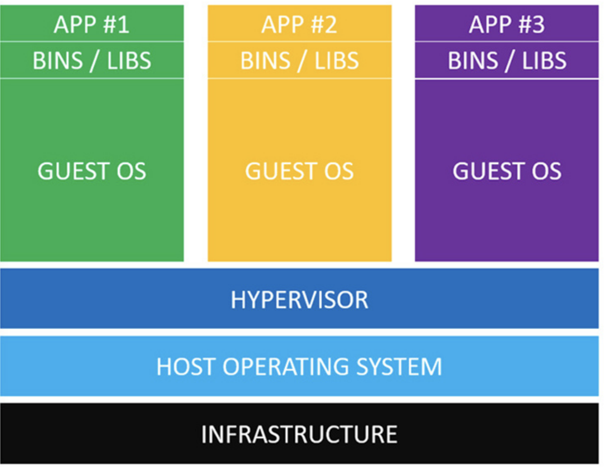
- Sau đó là sự xuất hiện của VMware, đã cho phép chúng ta chạy nhiều ứng dụng trên 1 server một cách an toàn. Nó có thể chạy các ứng dụng mới trên các máy chủ hiện có với dung lượng dự phòng=> Tiệt kiệm 
- Tuy nhiên thì VMs không hoàn hảo, mỗi OS đều tiêu thụ CPU, RAM và tài nguyên khác điều đó có thể sử dụng để sử dụng nhiều ứng dụng hơn. Chưa hết,vài trường hợp ,mỗi OS yêu cầu 1 license . VM khởi động chậm và tính di động không lớn(di chuyển giữa các trình ảo hóa và nền tảng đám mây khó hơn mức cần thiết)
### Containers
Một chương trình chạy hoàn hảo trên một máy, nhưng khi chuyển sang máy khác thì lại trở nên hỗn loạn?
- Là một phương pháp đóng gói ứng dụng với tất cả các phụ thuộc và cấu hình cần thiết để ứng dụng có thể chạy với các phụ thuộc của mình và gói đó dễn dàng chia sẻ và di chuyển giữa một nhóm phát triển và nhóm hoạt động ứng dụng đó  
Trên thực tế , tất cả containers trên một máy chủ chia sẻ chung hệ điều hành của máy chủ dẫn đến giảm chi phí licens . Tiết kiệm về thời gian và tài nguyên. Di chuyển conteainer từ máy tính bạn sang cloud sau đó đến VM...một cách dễ dàng.
### Linux containers
- Google LLC đã đóng góp nhiều công nghệ liên quan đến container vào nhân Linux. Không có những thứ này và những đóng góp khác, chúng ta sẽ không có các containers hiện đại ngày hôm nay
- Công nghệ chúng sự phát triển các containers bao gồm:  kernel namespaces, control groups, union filesystems và Docker. Các container phức tạp maic vho đến khi Docker xuất hiện, các conteainer dễ tiếp cận

#### Công nghê Docker Underlying
Docker được viết bằng Go và tận dụng một số tính năng của nhân Linux để cung cấp chức năng của nó.
- `Namespace`:Docker sử dụng một công nghệ được gọi là  Namespace  để cung cấp không gian làm việc cho container. Khi bạn chạy một container, Docker tạo một tập hợp các Namespace cho container đó.
Những Namespace này cung cấp một lớp cô lập. Mỗi khía cạnh của một container chạy trong một Namespace riêng biệt và quyền truy cập của nó bị giới hạn trong Namespace đó.
- `Control groups`: Docker Engine trên Linux cũng dựa vào một công nghệ khác gọi là Control groups (cgroups). Một nhóm giới hạn một ứng dụng cho một bộ tài nguyên cụ thể. Các Control groups cho phép Docker Engine chia sẻ tài nguyên phần cứng có sẵn cho các Container và tùy chọn thực thi các giới hạn và ràng buộc. 
- `Union file systems`: Các hệ thống tệp Union, hay UnionFS, là các hệ thống tệp hoạt động bằng cách tạo các lớp, làm cho chúng rất nhẹ và nhanh. Docker Engine sử dụng UnionFS để cung cấp các khối xây dựng cho container. Docker Engine có thể sử dụng nhiều biến thể UnionFS, bao gồm AUFS, btrfs, vfs và DeviceMapper.

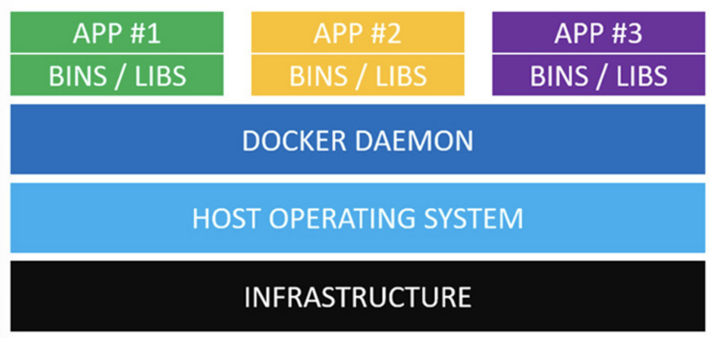

- Docker daemon có thể giao tiếp trực tiếp với hệ điều hành của server và phân bổ tài nguyên cho các Docker container đang chạy, đảm bảo mỗi container hoạt động độc lập với các container khác và hệ điều hành của server. 

- Thay vì phải đợi một phút để máy ảo khởi động, người dùng có thể khởi động Docker container chỉ trong vài mili giây và tiết kiệm được rất nhiều dung lượng ổ đĩa và các tài nguyên hệ thống khác do không cần phải sử dụng “guest OS” cồng kềnh cho mỗi ứng dụng. Người dùng sẽ không cần ảo hóa vì Docker chạy trực tiếp trên hệ điều hành của server.

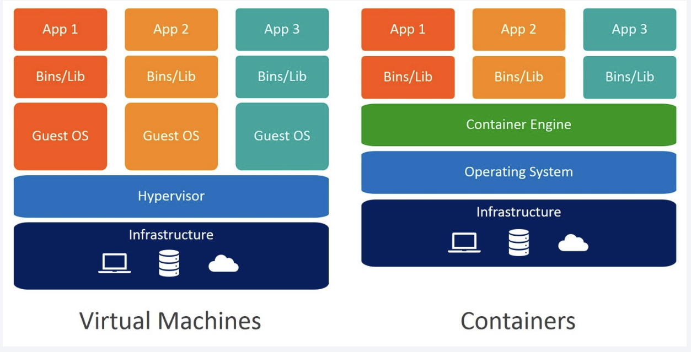

|Virtualization|Docker container|
|---|---|
|Kích thước (dung lượng) lớn.|	Kích thước (dung lượng) nhỏ.|
|Mỗi máy ảo sẽ có một hệ điều hành riêng.|Container sẽ sử dụng hệ điều hành của host.|
|Ảo hóa về mặt phần cứng|Ảo hóa về mặt hệ điều hành|
|Thời gian khởi động tính theo phút|Thời gian khởi động tính theo mili giây|
|Hoàn toàn bị cô lập|Cô lập ở mức tiến trình|
Các thư viện có thể được chia sẻ với các containers, do đó, nó loại bỏ việc phải tạo 10 bản sao cho cùng một thư viện trên một máy chủ, giúp tiết kiệm không gian hơn nữa.
### Docker
Docker tạo ra, quản lý thậm chí là phối hợp các container (môi trường độc lập và tách biệt để khởi chạy. Khi cần triển khai lên bất kỳ server nào chỉ cần run container của Docker thì ứng dụng của bạn sẽ được khởi chyaj ngay lập tức )

- Lợi ích của Docker:
   - Bạn có thể khởi chạy container trên mỗi hệ thống mà bạn muốn.
   - Container có thể build và loại bỏ nhanh hơn máy ảo
   - Dễ dàng thiết lập môi trường làm việc. Chỉ cần config 1 lần duy nhất và không bao giờ phải cài đặt lại các dependencies
  
Một container đang chạy chia sẻ hạt nhân của máy chủ mà nó đang chạy. Một ứng dụng container Windows sẽ không chạy trên một mãy chủ Docker dựa trên Linux. Các container Windows yêu cầu máy chủ Windows và các container Linux yêu cầu máy chủ Linux.


#### Kubernetes
- Các container cần được điều phối và lên lịch, làm cách nào để bạn nâng cấp ứng dụng một cách liền mạch mà không bị gián đoạn dịch vụ? làm cách nào để bạn theo dõi tình trạng của ứng dụng, biết khi nào có sự cố và khởi động lại ứng dụng đó một cách kịp thời.
- Và Kubernet là một giải pháp cho việc sắp xếp và điều phối các container
- Kubernet sử dụng Docker như runtime container mặc định, công nghệ level thấp rằng kéo images và bắt đầu và dừng container.
- Kubernet có giao diện runtime container có thể cắm được để dễn dàng trao đổi Docker cho một runtime container khác
Trong tương lai, Docker có thể được thay thế bởi `containerd` như runtime container mặc định trong Kubernets.*`containerd` là phần chuyên dụng nhỏ của Docker thực hiện các nhiệm vụ cấp thấp để bắt đầu và dừng các container*

# Chap2. Docker
##### Docker là gì?
Docker là một nền tảng đóng gói container
Docker là nền tảng cho phép lập trình viên và quản trị hệ thống để phát triển, vận chuyển và chạy(thống nhất trên các môi trường khác nhau) ứng dụng 
##### Docker có thể làm gì
- Sao lưu môi trường phát triển nên bất kì đâu
- Chạy một bản đóng gói( contanier )trên các môi trường khác nhau

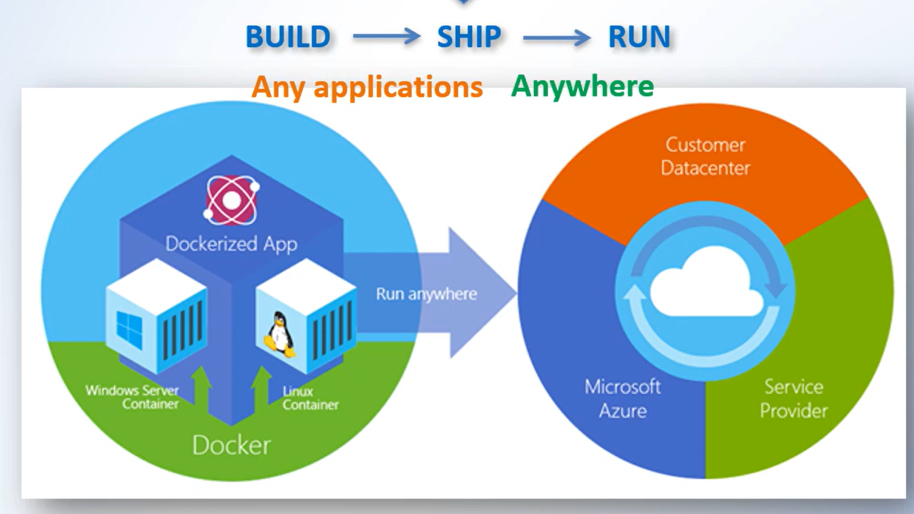

##### Docker architecture


Docker sử dụng kiến trúc Client- Server. Client Docker giao tiếp với daemon Docker thành phần thực hiện các công việc trong việc xây dựng, chạy và phân phối các container. 

Trình client và trình daemon của Docker giao tiếp bằng API REST, qua các port UNIX hoặc interface Network.


Docker Engine là cốt lõi của hệ thống Docker; nó là ứng dụng được cài đặt trên máy chủ, Engine này là một ứng dụng Client-Server các thành phần bên dưới.

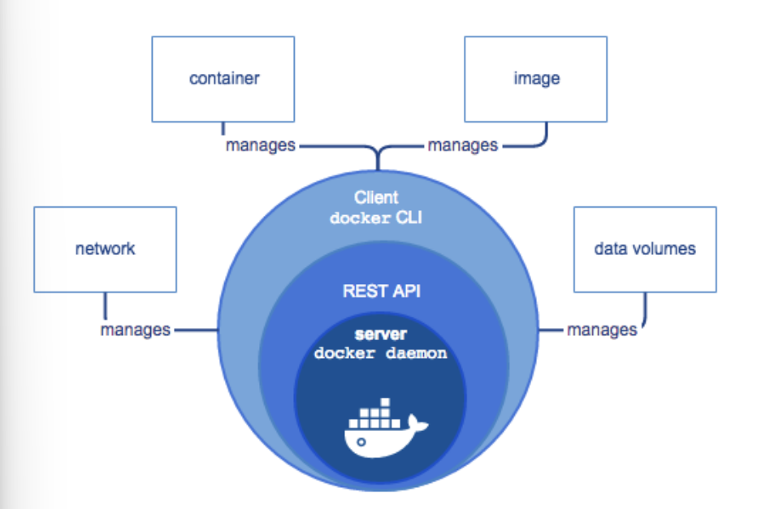

- Server là một loại chương trình chạy ngầm, được gọi là tiến trình daemon (lệnh dockerd).
- API REST, chỉ định các interface mà các chương trình có thể sử dụng để nói chuyện với daemon và hướng dẫn nó phải làm gì.
- Command-line interface (CLI) client ( docker command ).

Docker daemon:

Trình nền Docker (dockerd) lắng nghe các yêu cầu API Docker và quản lý các đối tượng Docker như Image, Container, Network và Volume. 

Docker image là các file mà khi mỗi lần đóng gói 1 ứng dụng sẽ tạo ra một image và được đưa vào kho chung. Khi muốn chạy ứng dụng đó thì image sẽ được đưa vào bộ nhớ RAM tạo thành container
- Docker Client:

Thành phần key Client Docker được nhiều người dùng Docker sử dụng tương tác với Docker. Khi bạn chạy các lệnh docker, Client sẽ gửi các lệnh này đến dockerd. Lệnh docker sử dụng API Docker và Client Docker có thể giao tiếp với nhiều hơn một daemon.
    - docker build cho phép đóng gói một ứng dụng thành docker image
    - docker pull cho phép tải một docker images từ kho
    - docker run docker image thành docker container

- Docker registry:
Docker registry là nơi lưu trữ Image Docker, nó có thể là public hoặc private registry. Docker Hub và Docker Cloud là các public registry có sẵn cho mọi người và tùy chọn khác là tạo đăng ký riêng của bạn. 


# Chap3 Installing Docker
### Installing Docker
#### Cài đặt trên Windows
Vào trang web 
Sau đó vào `product` chọn Docker Desktop 
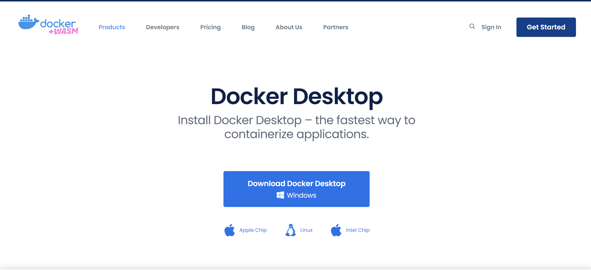
Trong quá trình cài đặt nếu bạn gặp lỗi này


thì hãy làm theo hướng dẫn ở trang sau:
(https://learn.microsoft.com/en-us/windows/wsl/install-manual#step-4---download-the-linux-kernel-update-package)

Sau khi làm theo hướng dẫn và tạo tài khoản trên Docker Hub sẽ có giao diện như sau

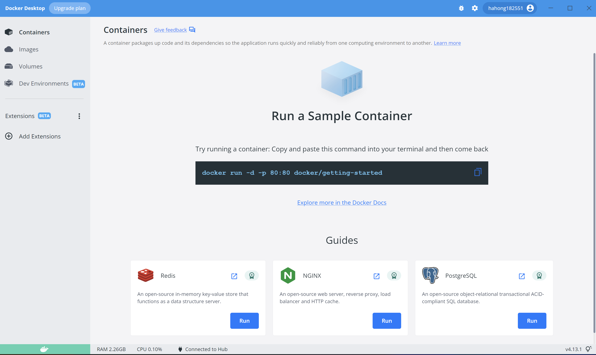

#### Cài đặt trên Linux (CentOs)
Bước 1. Xóa tất cả các versions cũ 
```sh
yum remove docker \
           docker-client \
           docker-client-lastest \
           docker-common \
           docker-latest \
           docker-latest-lograotate \
           docker-logrotate \
           docker-engine
```
Bước 2. Update các bản cập nhập trong repo
```sh
yum update
```
Bước 3. Trước khi cài docker-ce cần set up Docker repository và thêm kho lưu trữ
```sh
yum install -y yum-utils \
               device-mapper-persistent-date \
               lvm2
```
```sh
yum-config-manager \
--add-repo \
http://download.docker.com/linux/centos/docker-ce.repo
```
Bước 4. Cài đặt docker ce
```sh
yum install docker-ce docker-ce-clo containerd.io
```

Bước 5. Start docker sau đó kiểm tra trạng thái của docker
```sh
systemctl start docker
systemctl status docker
```
### Chap4. Tổng quan
#### Images
- Docker image là một file chứa các source code, libraries, dependencies, tools và các files khác cần thiết cho một ứng dụng để chạy.

- Có tính chất read-only của chúng, nó cho phép các developers test và thử nghiệm phần mềm trong điều kiện ổn định, thống nhất.

- Vì theo một cách nào đó, images chỉ là các mẫu, bạn không thể start hoặc run chúng. Những gì bạn có thể làm là sử dụng mẫu đó làm cơ sở để xây dựng một container. Một container cuối cùng chỉ là một image đang chạy. Khi bạn tạo một container, nó sẽ thêm một lớp có thể ghi lên trên image bất biến, nghĩa là bây giờ bạn có thể sửa đổi nó.

- Image mà ở đó bạn tạo một container tồn tại riêng biệt và không thể thay đổi. Khi bạn chạy một môi trường containerized, về cơ bản, bạn tạo một bản sao đọc-ghi của image bên trong container. Lúc này nó sẽ thêm một Container Layer cho phép sửa đổi toàn bộ bản sao của image.

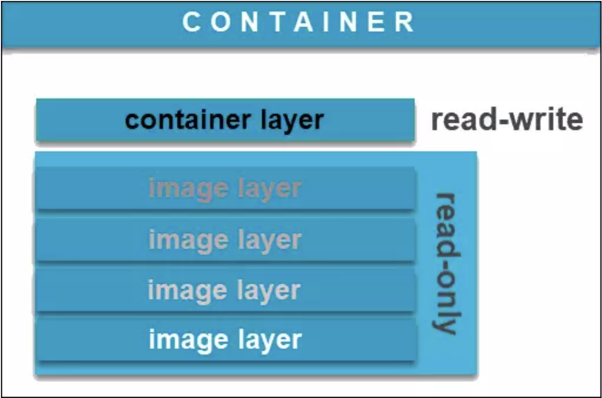
Bạn có thể tạo số lượng Docker image không giới hạn từ một image base. Mỗi khi bạn thay đổi trạng thái ban đầu của một image và lưu trạng thái hiện có, bạn tạo một image mới với một layer mới ở trên nó.

Do đó, Docker image có thể bao gồm một loạt các layer, mỗi layer khác nhau nhưng cũng có nguồn gốc từ layer trước. Các image layer đại diện cho các readonly-file mà chứa thêm các container layer mỗi khi bạn sử dụng nó để khởi động một virtual environment.

Mỗi image sẽ có một ID image duy nhất, Khi tham chiếu hình ảnh, bạn có thể tham khảo chúng bằng ID hoặc tên


#### Container
Docker container là một run-time environment mà ở đó người dùng có thể chạy một ứng dụng độc lập.Không chỉ đảm bảo cho ứng dụng hoạt động như nhau trong các môi trường giống nhau, nó còn làm đơn giản việc cài đặt và chia sẻ cài đặt này cho các thành viên trong team.
Vì container hoạt động độc lập,bạn sẽ không cần lo lắng việc máy tính của bạn bị xung đột do ứng dụng đang được phát triển được chạy trong container.

*Image có thể tồn tại mà không cần container, trong khi container chạy thì cần có image đã tồn tại. Vì vậy, container phụ thuộc vào image và sử dụng nó để tạo ra run-time environment và chạy ứng dụng trên đó*

### Một số câu lệnh cơ bản

`docker <component> <command>`
Component: image, container, network, volume, ...
Commands: ls, run, exec, stop, pull
#### Image
Liệt kê các image có trong local
```sh
docker image ls
```
hoặc 
```sh
docker images
```
Để kéo một image từ docker hub về docker host
```sh
docker image pull <image>:<tag>
```
Để tải image đã build từ local lên registry
```sh
docker image push <image>:<tag>
```
Để xóa các image không còn sử dụng nữa 
```sh
docker image prune
```
#### Container 
Để chạy container
```sh
docker container run <image>
```
Để liệt kê danh sách các container đang chạy 
```sh
docker container ls 
``` 
*Thêm option -a để liệt kê các container đã shutdown*
Hoặc `docker ps`
Để dừng container đang chạy
```sh
docker container stop <container_id>
```
Để xóa container đã shutdown không dùng nữa
```sh
docker container prune
```
Để chạy một câu lệnh trong một container bất kì 
```sh
docker container exec <container_id> <command>
```

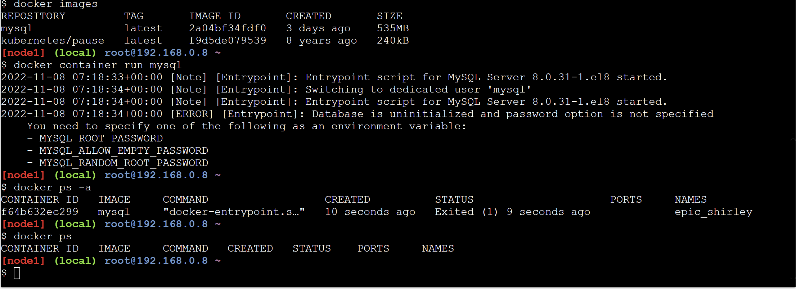

Tại sao container kết thúc ngay lập tức?
Đây là tiến trình cần tương tác sự tương tác với người dùng, trong container thì chưa có user sử dụng. Cần gắn thêm cờ '-it'

Dockerfile là một file dạng text, chứa các thông tin về môi trường thực thi phần mềm, cách xây dựng một ứng dụng và các phụ thuộc cho Docker Image. Từ những câu lệnh đó, Docker sẽ build ra Docker image.
  
## Chap 5. Docker Engine
### TLDR
- Docker Engine là phần mềm cốt lõi chạy và quản lý các container. Docker engine là modul thiết kế và xây dựng từ nhiều công cụ đặc biệt nhỏ, dựa theo các tiêu chuẩn mở như OCI( Open Container Initiative)
- Docker Engine được làm từ nhiều công cụ chuyên dụng phối hợp với nhau để tạo và chạy ác container như API, runtimes....

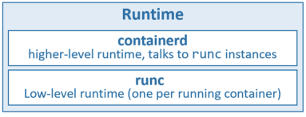

RUNC giao tiếp với HĐH và các container start và stop. Mỗi container đang chạy trên Docker đều có một phiên bản RUNC quản lý nó.

Containerd quản lý toàn bộ vòng đời của một container, bao gồm kéo hình ảnh, tạo giao diện mạng và quản lý các phiên bản RUNC cấp thấp hơn.

Chu kì sống của container:

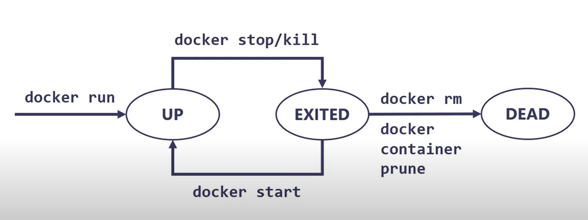
### Deep dive
- Docker daemon: chứa tất cả code cho Docker client, Docker API, image builds,... và quản lý các network, volume, image, container
- LXC cung cấp cho daemon quyền truy cập vào các khối xây dựng cơ bản của các container tồn tại Linux kernel như namespaces and control group(cgroups)
Sau này Docker đã cho ra đời Libcontainer để thay thế LXC 


