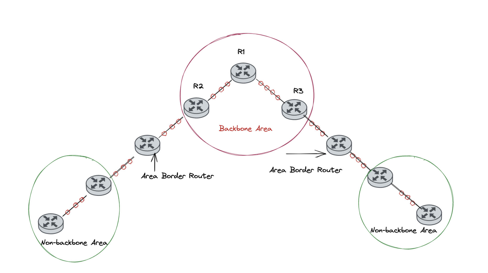
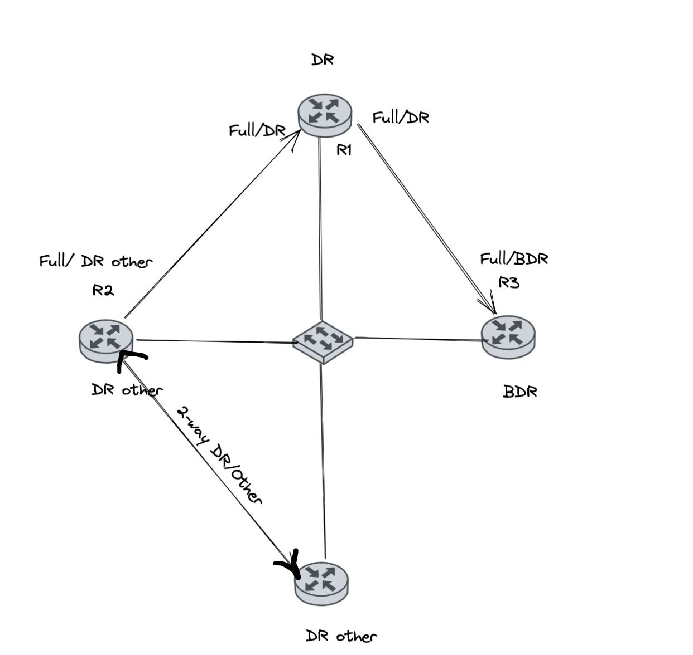

## Overview
1. Giao thức định tuyến OSPF (Open Shortest Path First)

### 1. Giao thức định tuyến OSPF

- Giao thức định tuyến OSPF là giao thức định tuyến động thuộc nhóm Link State. 
- Trên mỗi Router đều có bảng định tuyến thông qua việc đồng nhất bảng cơ sở dữ liệu trạng thái đường link (LSDB - Link State D atabase). Từ bản đồ mạng này Router sẽ tự tính toán ra đường đi ngắn nhất và xây dựng bảng định tuyến cho nó.

#### 1.1 Đặc điểm của OSPF

- Định tuyến theo kiểu Link State
- Chỉ số AD (Administrative Distance): 110
- Metric phụ thuộc vào BandWidth
- OSPF chạy trên nền giao thức IP, có protocol ID = 89 

<!-- AD- Administrative Distance: là chỉ số ưu tiên của một giao thức trong hệ thống mạng có từ 2 hay nhiều giao thức định tuyến được triển khai -->

#### 1.2 Hoạt động của Router khi tham gia định tuyến OSPF

- Router ID
- Thiết lập Neighbor
- Trao đổi LSDB (Link State Database)
- Xây dựng bảng định tuyến (sử dụng giải thuật Dijkstra)

##### 1.2.1 Router ID
- Router ID: là một giá trị dùng để định danh cho Router, khi Router tham gia vào môi trường định tuyến OSPF.
- Router ID có định dạng là 1 IP nhưng nó không phải IP 
Cách bầu Router ID: Lấy IP cao nhất trong các interface active và ưu tiên cổng loopback
- Để tạo ra Router-ID có 2 cách:
    - Router tự động tạo ra
    - Tự config

**Cách 1:** Tự động tạo
- Dựa vào interface nào có địa chỉ `IP cao nhất` thì nó lấy IP đó làm Router ID.
    - Ví dụ: Router có f0/0 là 10.0.0.1, f0/1 là 172.16.1.1, s0/0/0: 192.168.1.1 => Router ID là 192.168.1.1
- Nếu Router có loopback tồn tại và tham gia vào định tuyến thì Router-id `ưu tiên cho loopback` trước 
    - Ví dụ: lookback 0 = 4.1.1.1, lookback 1 = 4.2.2.2, f0/0=172.16.1.1, f0/1=192.168.1.1 => Router ID là 4.2.2.2

**Cách 2:** Cấu hình
- Router-id không nhất thiết là phải chọn IP có trên interface
- Vd: lookback 0 = 4.1.1.1, lookback 1 = 4.2.2.2, f0/0=172.16.1.1, f0/1=192.168.1.1
Ta có thể cấu hình để chọn Router-id = 100.100.100.100. Ip này không thuộc interface nào của router cả

##### 1.2.2 Thiết lập quan hệ láng giềng
- Các Router sẽ gửi gói tin Hello (10s/1 lần). Được dùng để tìm ra router láng giềng, chuyển một quan hệ láng giềng sang trạng thái 2 bước (2- Way), sau đó Hello giúp giám sát láng giếng khi nó bị lỗi.
- OSPF sử dụng địa chỉ multilcast : 224.0.0.5 khác với RIPv2 224.0.0.9
- Điều kiện để thiết lập quan hệ láng giềng:
    - Cùng Area-ID
    - Cùng subnet và subnet-mask
    - Cùng hello-timer và dead-timmer
    - Thoả mãn điều kiện xác thực

**Điều kiện 1: Cùng Area-ID**: 
- Cùng Area-id: Khi mạng lớn người ta chia làm nhiều vùng, vùng nào hỏng thì chỉ vùng đó chịu tác động. Mỗi một vùng sẽ đặt cho một Area-id. Vùng trung tâm có Area-id phải bằng 0. Mọi vùng khác phải có đường truyền trực tiếp về vùng 0 nó mới truyền được dữ liệu.

Các thuật ngữ liên quan đến Area-ID: 
- Backbone Area: Phải có ít nhất 1 vùng, kí hiệu: 0
- Non-backbone area: phải kết nối trực tiếp với vùng Backbone area, kí hiệu: 1-2^52 => Sẽ có 1 con router đứng giữa 2 vùng
- Backbone Router: Router nằm trong vùng backbone area
- Internal Router: là Router nằm trong vùng non-backbone area.
- Area Boder Router(ABR): Router nằm giữa ranh giới backbone area và non-backbone area.

**Điều kiện 2: Cùng Subnet và Subnet-Mask**: 

- VD1: R1 = 192.168.1.110/25, R2 = 192.168.130/25
    - Mạng chính: 192.168.1.0/24
    - Mượn 1 bit => 128 bước nhảy
    - Có 2 mạng 192.168.1.0/25 và 192.168.1.128/25

   =>  2 router không thể là neighbor của nhau được vì 2 IP trên khác mạng​

- VD2: R1 = 192.168.1.110/25 và R2 = 192.168.1.11/26
    - 2 router cùng mạng nhưng không thể làm neighbor của nhau vì không cùng subnet-mask

**Điều kiện 3: Cùng Hello Timer và Dead Timer:**
- `Hello Timer` là khoảng thời gian định kỳ router gửi các gói tin hello ra các cổng chạy OSPF
- `Dead Timer` là khoảng thời gian mà láng giềng chờ hello timer gửi gói tin cho mình. Nếu hết khoảng thời gian Dead Timer mà router đó không nhận đước các gói tin hello từ láng giếng, nó sẽ tự động xoá bộ dữ liệu được học từ láng giềng này.
- Giá trị mặc định của `Hello Timer / Dead Timer` là `10s/40s`
**Điều kiện 4: Thoả mãn điều kiện xác thực:**

- Cùng là plain-text
- Cùng xác thực MD5

- Trong hình trên, khi R3 chạy OSPF tuy nhiên k biết password thì không thể học được các thông tin định tuyến của R1, R2 mà chỉ có R1, R2 trao đổi thông tin định tuyến với nhau.

**=> Khi thoả mãn 4 điều kiện trên thì 2 con router sẽ trở thành láng giềng của nhau**

##### 1.2.3 Tìm đường đi tối ưu
- B1: thiết lập được neighbor của nhau. Sau đó liệt kê các neighbor vào trong neighbor của mình. Lúc này, mối quan hệ giưa các neighbor gọi là 2-way

- B2: Bắt đầu gửi thông tin trạng thái đường link để dựng lên 1 bảng database(bảng topology).

- B3: từ bảng topology nó bắt đầu dùng thuật toán Dijkstra để tìm ra đường đi tối ưu để đưa ra bảng định tuyến.

- B4: bảng LSDB chứa các LSA. Để có LSA thì nó phải trải qua các giai đoạn sau :

> Sau khi ở trạng thái 2-Way thì các con router sẽ gửi thông tin cho nhau để hình thành 1 bảng databse gọi là `Link State Database`.

**Giai đoạn 1:** Router sẽ gửi thông tin trạng thái đường link của nó qua láng giềng, gọi là ` LSA (Link State Advertisement)`

**Giai đoạn 2:** Trước khi gửi `LSA`, nó sẽ gửi 1 bản tin `DBD (Database Description)` để mô tả thông tin nó có được cho router neighbor

**Giai đoạn 3:** Khi neighbor nhận được DBD, nếu nó thấy thông tin nào trong DBD mà nó không có thì nó sẽ gửi `LSR (Link state request) ` để xin thông tin thiếu. 

**Giai đoạn 4:** Khi router nhận được `request LSR` thì nó phải trả những thông tin thiếu cho router bằng `LSA` nằm bên trong `LSU (Link State Update)`.

**Giai đoạn 5:** Khi router nhận được `LSU` thì nó sẽ bỏ phần `LSU` đi và lấy phần `LSA`. Khi nhận xong nó sẽ gửi lại `LSACK (Link state acknowledgement)` để xác nhận là đã nhận.

> Sau khi có LSDB thì router có thể tự chọn được đường đi tốt nhất dựa vào thuật toán Dijkstra

### 1.3 Môi trường mạng
- Tùy thuộc vào mỗi 1 môi trương mạng thì nó có 1 cách trao đổi khác nhau để nó tìm được đường đi tốt nhất.

- Trong môi trường mạng có 2 môi trường chính:

    - a. môi trường point to point
        - là môi trường mà 2 router kết nối với nhau bằng cổng serial(WAN).
        - Khi ở môi trường này thì các router gửi LSDB trực tiếp qua nhau thì từ mối quan hệ 2-way chuyển sang mối quan hệ FULL (nếu không quan hệ trực tiếp với nhau thì ko cần chuyển quan hệ 2-way)
    - b. môi trường broadcast multi access
        - các router kết nối với nhau = interface LAN.
        - Trước khi trao đổi thông tin thì các router sẽ bầu chọn ra 1 router đóng vai trò làm chủ đạo gọi là `DR(designated router)` có nhiệm vụ tiếp nhận các thông tin trao đổi và gửi qua cho các router khác.
        - `BDA(backup designated router)` là router dự phòng cho DR.
        - `DA other`: Những router còn lại. Những router không nói chuyện trực tiếp với nhau (vẫn giữ trạng thái 2-way) mà phải thông qua DR. Đồng thời DR gửi thông tin copy cho BDA để backup
        
        

        - Cách bầu DR, BDR:

            - priority: chỉ số ưu tiên của cổng. Có giá trị từ 0 – 255(default=1)

                - Router có priority cao nhất làm DR, cao thứ 2 làm BDR, còn lại DA other.

                - Khi đặt priority = 0 cho 1 
                interface router thì router đó không bao giờ được làm DR,BDR.

            - Router-id: Khi xét quá trình chọn DR thì router-id sẽ không xét loopback

                - Riêng DR và BDR nói chuyện với nhau = 224.0.0.6 còn lại nói chuyện với nhau = 224.0.0.5

                - Trong OSPF có 1 quy luật Non-preemptive: nghĩa là không bầu chọn lại.Khi DR chết BDR thay nhưng sau đó DR sống lại thì nó sẽ ko được bầu chọn lại làm DR lại như cũ.

#### Tài liệu tham khảo:

[OSPF Security Zone](https://securityzone.vn/t/bai-14-tim-hieu-giao-thuc-dinh-tuyen-ospf.101/)

[Link State OSPF](https://www.daihockhonggiay.com/blogs/post/link-state-ospf)

[OSPF Hosting Viet](https://hostingviet.vn/giao-thuc-ospf)

[Tài liệu về subnet mask cơ bản 1](https://hocmangcoban.blogspot.com/2014/04/network-subnet-subnet-mask-broadcast.html)

[Tài liệu về subnet mask cơ bản 2](https://vietnix.vn/subnet-mask-la-gi/)

