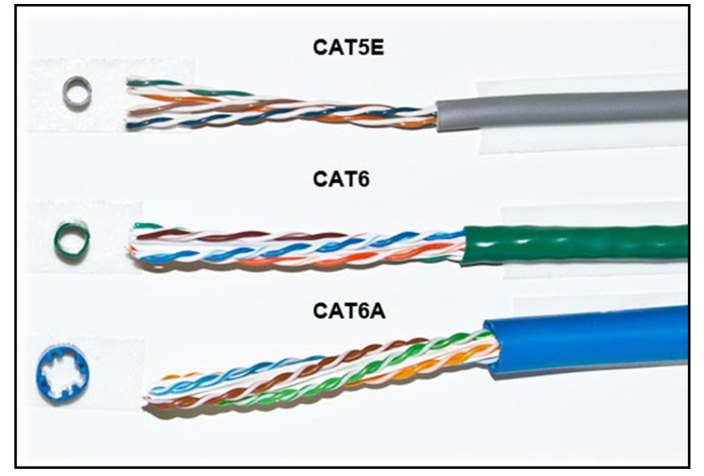
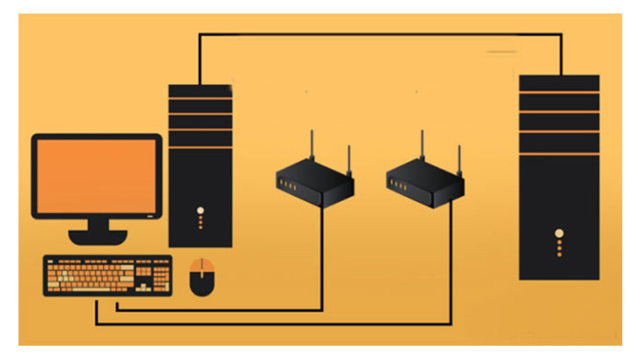

# Mạng Ethernet LAN
1. Ethernet là gì?     
    * Ethernet là một họ của các công nghệ dùng để kết nối mạng máy tính.
    * Ethernet giúp các thiết bị như TV, laptop,... có thể kết nối với internet hoặc truyền dữ liệu cho các thiêt bị khác.
    > Tốc độ  truyền dữ liệu cao, cùng với độ bảo mật, độ tin cậy nên là Ethernet này càng được sử dụng rộng rãi hơn.

2. Mạng LAN là gì?    
LAN là viết tắt của Local Area Network tạm dịch là mạng máy tính nội bộ, giao tiếp này cho phép các máy tính kết nối với nhau để cùng làm việc và chia sẻ dữ liệu.
* Chức năng mạng LAN
    * Chia sẻ dữ liệu và ứng dụng
    * Chia sẻ tài nguyên
    * Cung cấp đường kết nối đến mạng khác.
> Các chuẩn mạng LAN chủ yếu tập trung ở lớp vật lý và lớp liên kết dữ liệu trong mô hình OSI.
3. Cổng Ethernet là gì?   
    Cổng ethernet là một lỗ cắm trên các thiết bị mạng máy tính, dùng để kết nối các phần cứng có dây trong hệ thống mạng WAN, LAN, MAN... Cổng ethernet có mặt ở các thiết bị như router, switch, máy tính, TV,...

4. Cáp ethernet phổ biến hiện nay.
- Cáp CAT5E: Loại cáp này có đặc điểm ít bị nhiễm chéo và hỗ trợ truyền tín hiệu lên đến 1000Mbps.
- Cáp CAT6: CAT6 có rất nhiều đặc điểm tương tự như cáp CAT5E nhưng nó có băng thông lên đến 250 MHz, gấp 2.5 lần so với CAT5E.
- Cáp CAT6A: Đây là loại cáp tiên tiến nhất hiện nay. Nó có vỏ bọc dày bên ngoài để hạn chế nhiễu, băng thông đạt 500 MHz gấp đôi CAT6 và hỗ trợ truyền tín hiệu 1000Mbps ở khoảng cách 100m.    

5. Cách thức hoạt động  
 *   Cách thức truyền dữ liệu qua Ethernet có hai cách là lớp vật lý và lớp liên kết dữ liệu, trong chuyên ngành người ta còn gọi là Layer 1 và Layer 2. Khi hoạt động, Ethernet xác định hai đơn vị truyền là gói và khung (Packet và Framework), thông qua mô hình giao thức mạng OSI.
 *  Mỗi Framework phải nằm trong một gói chứa một vài byte thông tin, giúp thiết lập kết nối và đánh dấu vị trí. Trong Framework sẽ chứa các nội dung dữ liệu được truyền, địa chỉ truy cập vật lý, thông tin sửa lỗi và gắn thẻ Vlan.
 
 6. Ưu nhược điểm của mạng Ethernet.
 * Ưu điểm:
    * Độ bảo mật cao, đáng tin cậy nhờ sử dụng tường lửa để bảo mật dữ liệu.
    * Dữ liệu được truyền và nhận với tốc độ rất cao.
    * Rất dễ sử dụng mạng có dây.
* Nhược điểm:
    * Sử dụng trong phạm vi ngắn, hạn chế di chuyển.
    * Khó khăn trong việc bảo trì.
    * Chi phí lắp đặt tăng cao với Ethernet, hub, thiết bị chuyển mạch, bộ định tuyến. 

## Tài liệu tham khảo
[thầy Phương](https://www.youtube.com/watch?v=i6Vdy4ymf7s&list=PL5XLqU3Q-TRLqP79n8QAi2TdkW3hLtYbD&index=7)    
[Ethernet](https://www.thegioididong.com/hoi-dap/ethernet-la-gi-dung-de-lam-gi-so-voi-wifi-thi-nhu-the-nao-1314385)    
[LAN](https://netsystem.vn/ethernet-la-gi-cac-tinh-nang-hang-dau-cua-ethernet/)