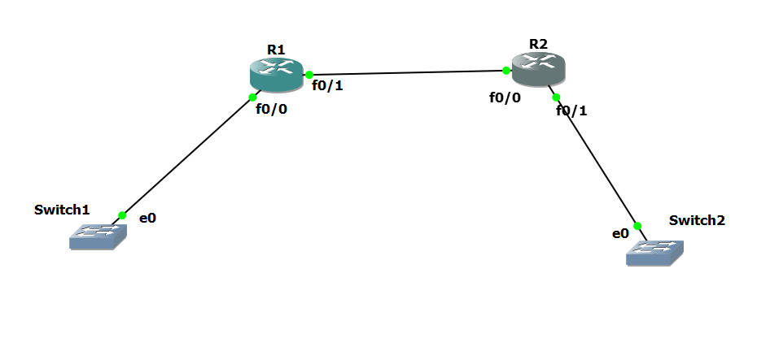
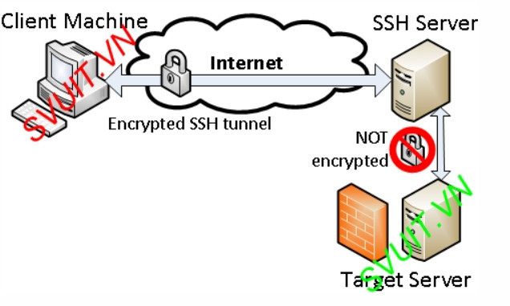
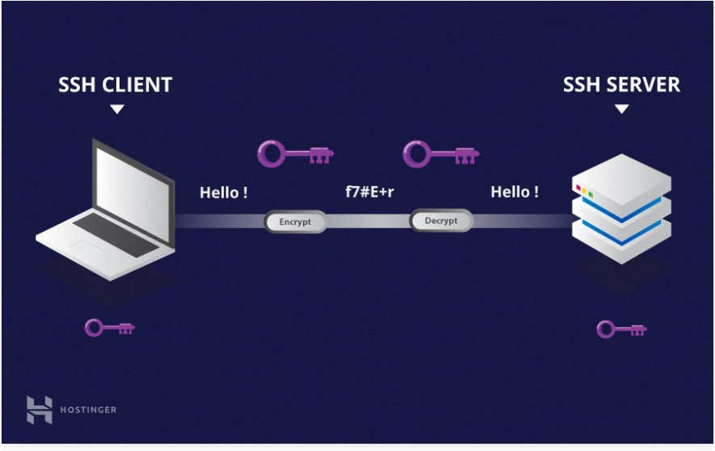
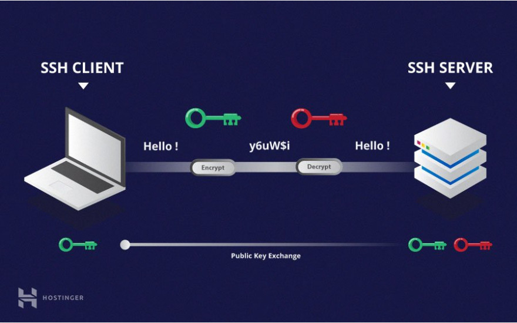
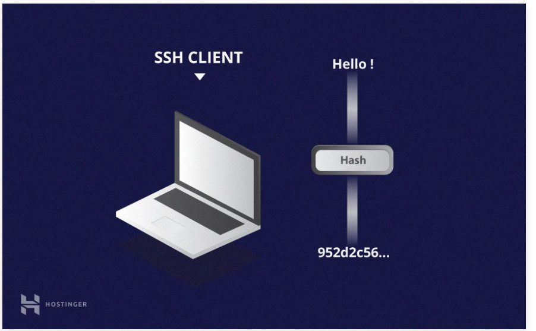
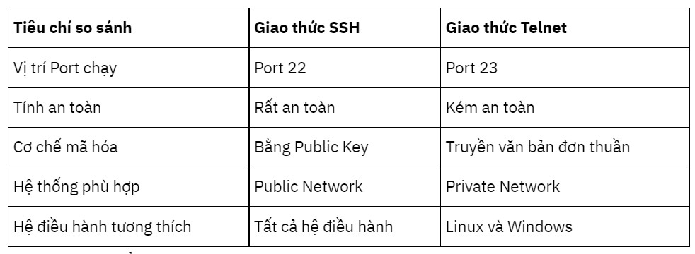

# Telnet, CDP, SSH
## Telnet
1. Telnet là gì?    
   

* TELNET (viết tắt của Terminal network) là một giao thức mạng (network protocol) được dùng trên các kết nối với Internet hoặc các kết nối tại mạng máy tính cục bộ LAN     
* Telnet có nhiệm vụ là cung cấp kết nối từ xa, đảm nhiệm việc gửi các lệnh hoặc dữ liệu đến kết nối mạng từ xa nên chúng rất phổ biến trong hệ thống mạng. Giao thức này xuất hiện vào năm 1969 và nó đáp ứng mọi nhu cầu cơ bản về giao diện dòng lệnh trên internet. 
2. Đặc điểm của Telnet.
- Telnet trên CISCO IOS cho phép cấu hình Inband : dùng để truy cập từ xa qua mạng internet.
- Telnet là giao thức của tầng ứng dụng.
- Telnet sử dụng giao thức TCP chạy trên port 23.
- Telnet là một giao thức đơn giản, giao thức telnet hỗ trợ xác thực người dụng dưới dạng Plaintext (văn bảng) qua mạng và dữ liệu trao đổi trong các phiên telnet cũng được truyền dưới dạng PlainText. Vì vây, giao thức này hoàn toàn không bảo mật.

## CDP - Cisco Discovery Protocol
### CDP là gì?

- CDP - Cisco Discovery protocol: CDP là giao thức chỉ chạy trên các thiết bị Cisco IOS.   
- CDP dùng để kiểm tra layer 2 các thiết bị kết nối trực tiếp với nhau.
- CDP cho phép thấy được các thông tin của các thiết bị kết nối trực tiếp với nó như :
    * Device-id : hostname của láng giềng.
    * Local-interface : cho biết cổng của mình đấu nối với láng giềng
    * Outgoing port : cổng của láng giềng đấu với mình
    * Platform : cho biết dòng phần cứng của láng giềng là gì vd: R2801,    2811,2960,3560...
    * Capability : cho biết khả năng của láng giềng là gì. Cho biết láng giềng là con Router, switch có chạy giao thức IGMP hay không(công nghẹ dùng trong multicast)
    * IP của Neighbor (IP của thiết bị láng giềng)
    * IOS version của láng giềng

## SSH - Security Shell
- Là giao thức chạy trên Application layer.
- Giao thức SSH sử dụng TCP chạy trên port 22
- SSH tượng tự như telnet là giúp cho việc truy cập từ xa nhưng nó hơn telnet ở điểm là nó cung cấp 1 cơ chế mã hóa toàn bộ dữ liệu. Còn telnet thì truyền dữ liệu ở dạng clear text. Nên SSH bảo mật hơn.
- SSH thiết lập một kênh kết nối riêng tư cho người dùng, hơn nữa nó tunneling của các công cụ nó cho truyền các giao thức khác bên trong tunneling này.
- SSH có cơ chế mã hóa đủ mạnh để ngăn chặn các tấn công nghe lén, đánh cắp thông tin trên đường truyền => sử dụng SSH trong hệ thống để an toàn và bảo mật hơn.        

### Kỹ thuật mã hóa SSH
Có 3 cách khác nhau để mã hóa qua SSH:
1. Symmetrical encryption
    
* Symmetric encryption là một dạng mã hóa sử dụng secret key ở cả 2 chiều mã hóa và giải mã tin nhắn bởi cả host và client. Có nghĩa là ai nắm được khóa đều có thể giải mã tin nhắn trong quá trình chuyền.
* Symmetric keys được sử dụng để mã hóa toàn bộ liên lạc trong phiên giao dịch SSH. Cả client và server tạo chung một key bí mật như là một phương thức thỏa thuận, và key đó không được tiết lộ cho bên thứ ba.
* Điều khiến cho thuật toán an toàn là vì key không được truyền giữa client và host. Thay vào đó, cả 2 máy tính chia sẽ thông tin chung và sau đó sử dụng chúng để tính ra khóa bí mật.Kể cả có máy khác bắt được thông tin chung, nó cũng không thể tính ra key bí mật vì không biết được thuật toán tạo key.
2. Asymmetric Encryption    
* Không giống với symmetrical encryption, asymmetrical encryption sử dụng 2 khóa khác nhau để mã hóa và giải mã. 2 khóa này được gọi là public key và private key.
  
* Không giống với quan niệm thông thường, asymmetrical encryption không được dùng để mã hóa toàn bộ phiên SSH. Thay vào đó, nó chỉ được sử dụng trong quá trình trao đổi thuật toán của khóa của symmetric encryption. trước khi bắt đầu một phiên giao dịch an toàn, cả 2 đồng ý tạo ra một cặp public-private key tạm, chia sẽ private keys để tạo một khóa secret key chung.
3. Hashing    
* Hashing một chiều là một dạng mã hóa khác sử dụng trong Secure Shell Connections. Hash một chiều khác với cả 2 phương thức mã hóa trên ở chỗ nó không được sinh ra để giải mã. Chúng tạo ra một giá trị duy nhất với độ dài nhất định cho mỗi lần nhập liệu mà không có hướng nào khác để khai thác

## So sánh Telnet và SSH
   

* SSH sử dụng hashes để xác nhận tính xác thực của tin nhắn. Nó được thực hiện bởi HMACs, hoặc Hash-based Message Authentication Codes.
* Mỗi tin nhắn được truyền đi phải chứa MAC, được tính bởi symmetric key, packet sequence number, và nội dung tin nhắn. 
# Tài liệu tham khảo
[Telnet](https://www.totolink.vn/article/135-telnet-la-gi-tim-hieu-ve-giao-thuc-telnet.html)   
[Telnet CDP SSH](https://securityzone.vn/t/bai-10-cau-hinh-telnet-cdp-ssh-tren-cisco-ios.10/)   
[SSH](https://www.hostinger.vn/huong-dan/ssh-la-gi-va-cach-su-dung-ssh-cho-nguoi-moi-bat-dau)