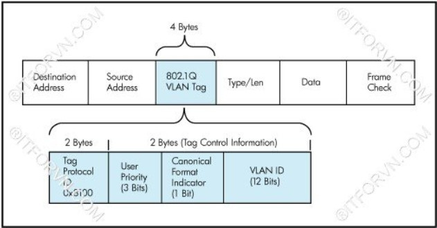

#  ***Trunking***     
## 1. Khái niệm   
Giả sử hệ thống có quá nhiều VLAN nối với nhau qua các Switch. Trunking được tạo ra nhằm giải pháp chỉ cần một đường kết nối mà vẫn đảm bảo tính thông suốt của các VLAN thay vì nhiều đường. Đường này gọi là đường Trunk.
## 2. Các chuẩn trunking trong một hệ thống mạng
###  Chuẩn IEEE 802.1Q (dot1Q)     
Dot1Q thực hiện chèn 4 byte sau trường Source Address của Ethernet Frame trên đường Trunk
     
#### Các trường trong 802.1Q VLAN Tag:
- Tag Protocol ID (16 bit): Định danh frame này đã được Tag và phân biệt với các frame chưa được tag trên đường trunk
- User Priority (3 bit): Sử dụng cho kĩ thuật QoS.
- Canoncial Format Indicator (1 bit): cho biết địa chỉ MAC định dạng ở dạng Token Ring hay Erthernet Frame.
- VLAN ID (12 bit): Cho biết frame này đang chạy trên đường trunk của VLAN nào.
> Cách thức xử lý frame: Khi Switch nhận được Frame có tag thông tin 802.1Q, nó sẽ đọc frame này và xem frame này đến từ VLAN nào. Sau đó nó sẽ gỡ bỏ Tag và trả lại frame về đúng nơi VLAN mà frame thuộc về.
>>Thực chất Tag DOT1Q chỉ được tag trên đường trunk để phân biệt các frame của các VLAN khác nhau.     
### Chuẩn ISL (Cisco Proprietary)
Thay vì chèn 4 byte vào Ethernet Frame thì người ta chèn 26 byte vào Header và trường CRC kiểm tra lỗi 4 byte vào Ethernet Frame.
    
#### Các trường trong một ISL Tag:
* DA(Destination Address):(40 bit) để báo hiệu bên nhận rằng frame đã được tag ISL.
* Type:(4 bit) chỉ ra type frame dùng là gì (token ring hay erthernet,...).
* User:(4 bit) chỉ ra độ ưu tiên của frame khi đi qua switch(XX00: normal priority, XX01: priority 1, XX10: priority 2, XX11: highest priority).
* SA(Source Address): (48 bit) địa chỉ nguồn của gói tin ISL. Tuy nhiên thiết bị nhận có thể bỏ qua địa chỉ này.
* LEN(Length): (16bit) cho biết kích thước của gói tin thực tế.
* AAAA03: (24 bit)
* HSA(High Bits of Source Address): (24 bit)
* BPDU: được set để tất cả gói tin BPDU được tag ISL(hoạt động trên STP). 
* INDEX:(16bit) chỉ ra chỉ số port nguồn của gói tin tồn tại trên Switch.
* RES: (16 bit) sử dụng khi Token ring hoặc FDDI được đóng gói frame ISL, với frame Ethernet trường RES được set tất cả bit 0.
>Chuẩn trunking này là chuẩn độc quyền của Cisco và chỉ chạy trên thiết bị Cisco. Hoạt động đóng Tag trên đường trunk và mở tag ISL cũng hoạt động giống như 802.1Q encapsulation.

# Tài liệu tham khảo
[trunking](https://itforvn.com/bai-6-vlan-trunking-vtp/)         
